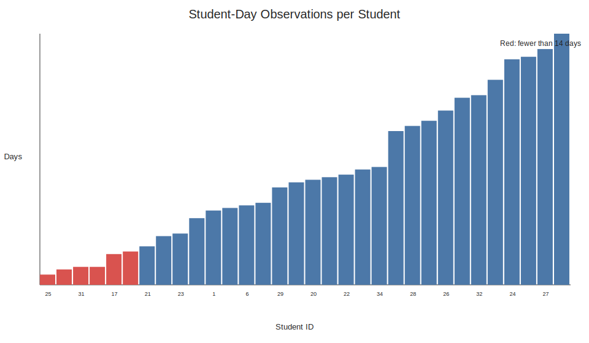
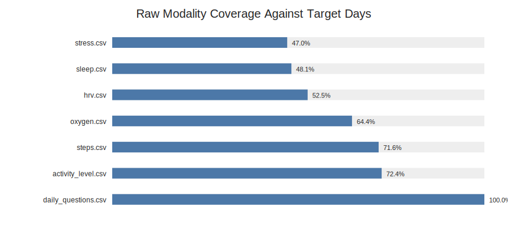
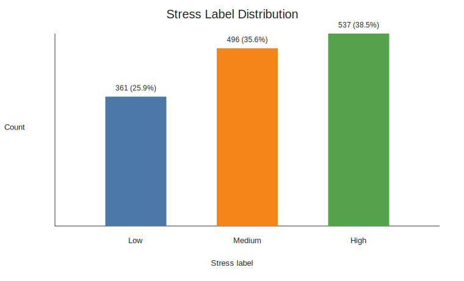
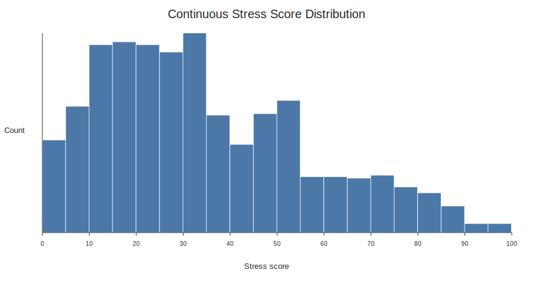
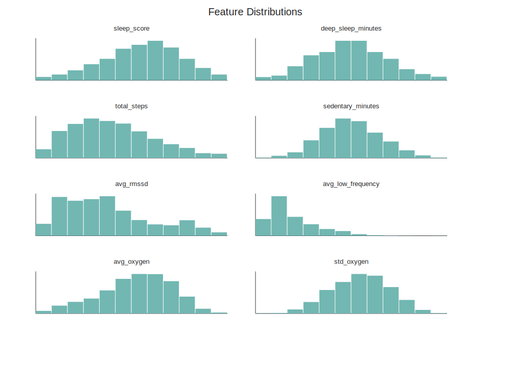
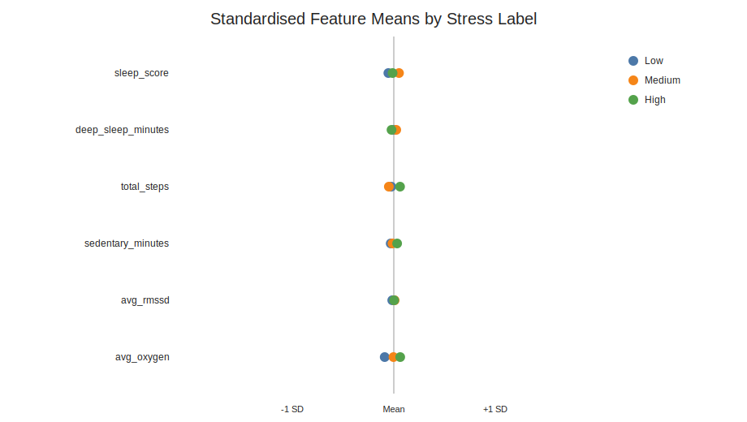
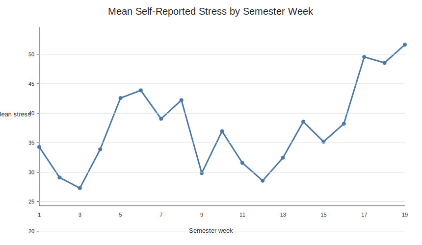
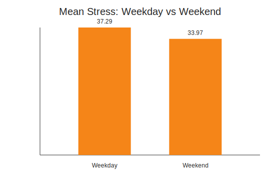

# EDA Detailed Report

## 1. Processed Table 审计

- 当前 processed table 为 `final_student_day_table_v01_processed.csv`。
- 样本规模：32 名学生，1394 条 student-day observations。
- 日期范围：2025-02-19 至 2025-06-30。
- 重复 `student_id + date` 行数：20，涉及 10 个重复 student-day。
- 其中 9 个重复 student-day 的 stress 数值不同，5 个重复 student-day 的 stress label 不同。
- 每名学生贡献天数：均值 43.56，中位数 40.5，最少 4，最多 98。

结论：processed table 目前存在少量重复 student-day。多数重复行的 wearable 特征相同，但问卷 stress/anxiety 不同，说明同一学生同一天可能提交了多次问卷。建模前不应保留这些重复行；应选择一个明确规则，例如按同日问卷平均 stress/anxiety 后重新分箱，或保留当天最后一次问卷记录。学生贡献天数差异也较大，少数学生样本很少，建模时需要使用 subject-aware split，并在 limitation 中说明测试集估计可能不稳定。

数据特别少的学生（少于 14 天）：
| student_id | processed_days |
| --- | --- |
| 25 | 4 |
| 11 | 6 |
| 31 | 7 |
| 2 | 7 |
| 17 | 12 |
| 4 | 13 |

相关图表：`figures/student_day_counts.svg`。

相关重复检查表格：
- `tables/processed_duplicate_check.csv`
- `tables/processed_duplicate_groups.csv`
- `tables/processed_duplicate_rows.csv`

## 2. Raw Data Coverage / Missingness 审计

这里的 raw audit 针对 `SSAQS dataset/` 下每个学生原始 CSV，而不是 processed table。统计口径是：以每个学生有 self-reported stress 的 raw target days 为基准，检查各模态在这些 target days 上是否有同日数据。

| index | file | students | total_target_days | covered_target_days | mean_student_coverage_percent | overall_target_day_coverage_percent |
| --- | --- | --- | --- | --- | --- | --- |
| 0 | activity_level.csv | 35 | 3118 | 2257 | 69.2 | 72.39 |
| 1 | daily_questions.csv | 35 | 3118 | 3118 | 100.0 | 100.0 |
| 2 | hrv.csv | 35 | 3118 | 1637 | 48.99 | 52.5 |
| 3 | oxygen.csv | 35 | 3118 | 2009 | 61.16 | 64.43 |
| 4 | sleep.csv | 35 | 3118 | 1501 | 44.61 | 48.14 |
| 5 | steps.csv | 35 | 3118 | 2232 | 68.49 | 71.58 |
| 6 | stress.csv | 35 | 3118 | 1466 | 43.68 | 47.02 |

Raw target days 总数为 3118，processed table 中保留了 1384 个 student-days。raw target days 中有 1384 天出现在 processed table，另有 1734 天没有进入 processed table。

结论：不能只用 processed table 的 0% 缺失来描述原始数据缺失情况。processed table 已经经过筛选、聚合或填补；报告中应区分 raw coverage 和 processed missingness。

相关表格：
- `tables/raw_file_audit_by_student.csv`
- `tables/raw_modality_coverage_against_target_days.csv`
- `tables/raw_modality_coverage_summary.csv`
- `tables/raw_target_to_processed_audit.csv`

相关图表：`figures/raw_modality_coverage.svg`。

## 3. Target EDA

- Low: 361 (25.9%)
- Medium: 496 (35.6%)
- High: 537 (38.5%)

当前 processed table 的标签阈值为：
| stress_label | count | min | max | mean | median | std |
| --- | --- | --- | --- | --- | --- | --- |
| Low | 361 | 0 | 17 | 9.873 | 11.0 | 5.246 |
| Medium | 496 | 18 | 38 | 27.349 | 28.0 | 5.752 |
| High | 537 | 39 | 100 | 62.482 | 57.0 | 18.258 |

结论：类别存在轻度不平衡，但不是极端不平衡。模型评估应以 macro-F1 为主要指标。注意：当前实际分箱是 Low = 0-17、Medium = 18-38、High = 39-100，与草稿报告中 0-33 / 34-66 / 67-100 的写法不一致，必须修改。

相关图表：
- `figures/figure_1_stress_label_distribution.svg`
- `figures/stress_continuous_distribution.svg`

## 4. Processed Missingness EDA

| index | feature_group | features | missing_cells | total_cells | missing_percent |
| --- | --- | --- | --- | --- | --- |
| 0 | Sleep | sleep_score, deep_sleep_minutes | 0 | 2788 | 0.0 |
| 1 | Activity | total_steps, sedentary_minutes, lightly_active_minutes, moderately_active_minutes, very_active_minutes | 0 | 6970 | 0.0 |
| 2 | HRV | avg_rmssd, avg_low_frequency, avg_high_frequency | 0 | 4182 | 0.0 |
| 3 | SpO2 | avg_oxygen, std_oxygen | 0 | 2788 | 0.0 |
| 4 | Fitbit stress score | STRESS_SCORE, CALCULATION_FAILED | 306 | 2788 | 10.98 |

结论：processed table 中主要建模特征已经没有缺失值。剩余缺失集中在 Fitbit 自带的 `STRESS_SCORE` 和 `CALCULATION_FAILED`，各缺失 153 行。`STRESS_SCORE` 不建议作为主模型输入，因为它本身是 Fitbit 的压力估计，和目标变量有概念重叠，存在 leakage 风险。

## 5. Feature Distribution / Outlier EDA

特征描述统计显示，多数建模特征已经标准化为均值约 0、标准差约 1。IQR 异常值检查结果如下：

| index | feature | q1 | q3 | iqr | lower_fence | upper_fence | outlier_count | outlier_percent |
| --- | --- | --- | --- | --- | --- | --- | --- | --- |
| 12 | STRESS_SCORE | 69.0 | 79.0 | 10.0 | 54.0 | 94.0 | 157 | 12.65 |
| 6 | very_active_minutes | -0.777 | 0.442 | 1.219 | -2.606 | 2.272 | 59 | 4.23 |
| 9 | avg_high_frequency | -0.797 | 0.531 | 1.328 | -2.788 | 2.522 | 45 | 3.23 |
| 8 | avg_low_frequency | -0.744 | 0.502 | 1.246 | -2.613 | 2.371 | 43 | 3.08 |
| 5 | moderately_active_minutes | -0.712 | 0.546 | 1.258 | -2.599 | 2.433 | 30 | 2.15 |
| 4 | lightly_active_minutes | -0.664 | 0.604 | 1.268 | -2.566 | 2.506 | 26 | 1.87 |
| 3 | sedentary_minutes | -0.69 | 0.658 | 1.347 | -2.711 | 2.678 | 8 | 0.57 |
| 2 | total_steps | -0.762 | 0.636 | 1.398 | -2.859 | 2.733 | 7 | 0.5 |

结论：activity minutes、HRV frequency 等变量存在一定极端值，但这类纵向 wearable 数据本身容易出现长尾分布。建议暂不直接删除异常值，而是在建模中使用对异常值相对稳健的模型或标准化后的特征；若后续模型表现异常，再考虑 winsorization 作为敏感性分析。

相关图表：
- `figures/feature_distributions.svg`
- `figures/feature_means_by_stress_label.svg`

## 6. Feature 与 Stress 的关系

Spearman 相关性最高的变量：
| index | stress |
| --- | --- |
| anxiety | 0.64 |
| STRESS_SCORE | 0.079 |
| std_oxygen | 0.069 |
| avg_oxygen | 0.061 |
| moderately_active_minutes | 0.058 |
| sedentary_minutes | 0.05 |
| total_steps | 0.047 |
| avg_high_frequency | 0.044 |

Spearman 相关性最低的变量：
| index | stress |
| --- | --- |
| total_steps | 0.047 |
| avg_high_frequency | 0.044 |
| lightly_active_minutes | 0.033 |
| avg_rmssd | 0.03 |
| very_active_minutes | 0.006 |
| sleep_score | -0.007 |
| deep_sleep_minutes | -0.017 |
| avg_low_frequency | -0.171 |

结论：`anxiety` 与 stress 的相关性较高，rho = 0.64，但它是同日问卷变量，不属于 wearable passive sensing 特征。若研究目标是用 Fitbit/行为数据预测 stress，主实验中应谨慎排除 `anxiety`，可作为辅助分析或 upper-bound comparison。其他 wearable 单变量相关性普遍较弱，说明需要多特征模型，而不是依赖单个强预测变量。

## 7. RQ3 Temporal EDA

- 平均压力最低：semester week 3，mean = 27.31，n = 59。
- 平均压力最高：semester week 19，mean = 51.63，n = 19。

Weekday / weekend 对比：
| day_type | count | mean | median | std |
| --- | --- | --- | --- | --- |
| Weekday | 1002 | 37.292 | 31.0 | 24.719 |
| Weekend | 392 | 33.967 | 29.0 | 25.296 |

结论：总体压力在学期后期明显升高，支持 RQ3 中加入 semester week、lag features 和 rolling means。weekday/weekend 差异可以作为辅助观察，但更核心的时间信号来自 semester progression。

相关图表：
- `figures/figure_4_temporal_stress_trend.svg`
- `figures/weekday_weekend_stress.svg`

## 8. EDA-driven Preprocessing Decisions

| 决策点 | 建议 | 理由 |
| --- | --- | --- |
| target 缺失 | 删除该 student-day | 无标签样本不能用于监督学习训练/评估 |
| feature 缺失 | 不建议简单整行删除；优先 per-student median imputation | 样本量小，整行删除可能引入偏差并破坏时间连续性 |
| 重复 student-day | 需要处理；建议按同日问卷平均 stress/anxiety 后重新分箱，或保留当天最后一次问卷 | 当前存在 10 个重复 student-day，其中 5 个 stress label 冲突 |
| stress label 分箱 | 报告改为当前实际阈值，或重新确认是否要改回等宽分箱 | 当前数据实际是 0-17 / 18-38 / 39-100 |
| 数据很少的学生 | 暂不自动删除，建模时使用 subject-aware split，并做 limitation 说明 | 删除学生会进一步缩小样本；但要承认估计不稳定 |
| `STRESS_SCORE` | 主实验排除 | Fitbit 自带压力估计可能造成 leakage |
| `anxiety` | 主实验建议排除或单独作为辅助实验 | 同日问卷变量与 stress 高相关，不符合 pure wearable prediction 设定 |
| 时间特征 | 建议加入 semester week、day-of-week、lag/rolling features | EDA 显示学期后期压力明显升高 |

## 9. 可直接写进报告的简短总结

The EDA shows that the processed dataset contains 1,394 rows from 32 students, corresponding to 1,384 unique student-day pairs because 10 student-days appear twice. These duplicates mostly reflect multiple questionnaire responses on the same day and should be resolved before modelling. The stress-label distribution is moderately imbalanced, while the main wearable-derived modelling features contain no missing values in the processed table. Raw modality coverage, however, varies substantially before preprocessing. Individual wearable features show weak monotonic correlations with self-reported stress, suggesting that prediction should rely on multivariate models rather than single-feature rules. Temporal analysis reveals a clear increase in mean stress toward the end of semester, motivating the inclusion of semester-week and lagged temporal features.
