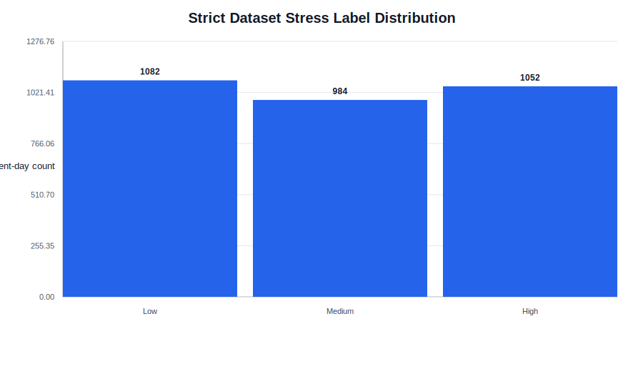
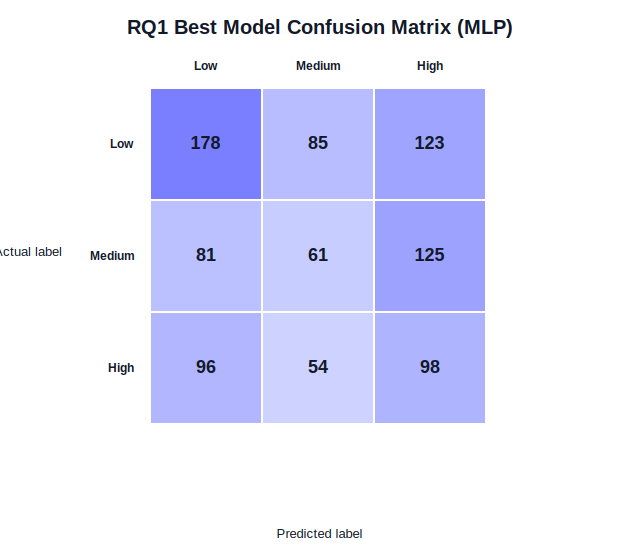
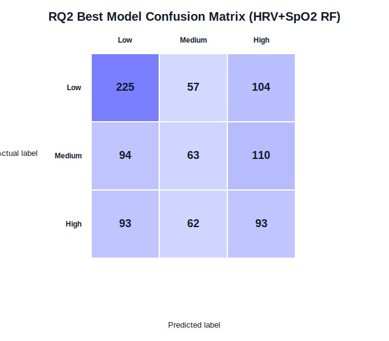
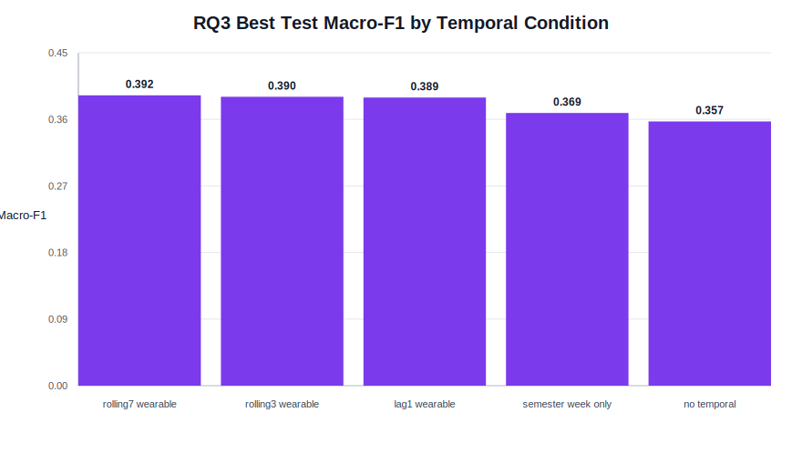
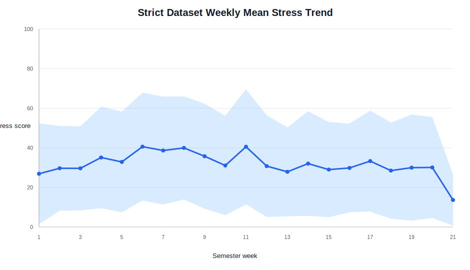

# COMP90049 A2 Report Evidence Pack

This file is the source-of-truth evidence pack for writing the final report. It is not a submission-ready report. Use it to keep numbers, tables, figures, and methodological claims consistent.


## Strict Pipeline Only

Use `modeling_outputs/strict_pipeline/` as the final result source.

Do not use these as final report results:

- `rq3_outputs/`: legacy RQ3 uses `anxiety`, `STRESS_SCORE`, and lagged self-reported `stress`; its macro-F1 0.656 is not comparable and should not appear in the final report.
- `modeling_outputs/legacy_pipeline/`: based on earlier processed data and less strict preprocessing.
- `eda_outputs/` figures for final quantitative claims. Use the strict-only EDA outputs under `modeling_outputs/strict_pipeline/eda/` instead.
- The DOCX draft's equal-width target bins `0-33 / 34-66 / 67-100`.

## Core Dataset Facts

Source data: SSAQS dataset, DOI `https://doi.org/10.1038/s41597-026-07085-7`.

Strict cleaned dataset:

| Item | Value |
|---|---:|
| Cleaned student-day observations | 3118 |
| Students | 35 |
| Unique `student_id + date` pairs | 3118 |
| Duplicate student-days after strict cleaning | 0 |
| Raw rows before duplicate resolution | 3133 |
| Duplicate student-day pairs resolved | 15 |
| Random seed | 49 |
| Train students | 26 |
| Test students | 9 |
| Train rows | 2217 |
| Test rows | 901 |

Target bins used in code:

| Label | Stress score range | Count | Percent |
|---|---:|---:|---:|
| Low | 0-17 | 1082 | 34.7% |
| Medium | 18-38 | 984 | 31.6% |
| High | 39-100 | 1052 | 33.7% |

Train/test label counts:

| Split | Students | Rows | Low | Medium | High |
|---|---:|---:|---:|---:|---:|
| train | 26 | 2217 | 696 | 717 | 804 |
| test | 9 | 901 | 386 | 267 | 248 |

Source files:

- `modeling_outputs/strict_pipeline/02_cleaned_student_day/strict_clean_student_day_table.csv`
- `modeling_outputs/strict_pipeline/03_model_data/strict_model_data.csv`
- `modeling_outputs/strict_pipeline/03_model_data/strict_split_assignments.csv`
- `modeling_outputs/strict_pipeline/02_cleaned_student_day/strict_cleaning_report.md`
- `modeling_outputs/strict_pipeline/03_model_data/strict_model_data_report.md`
- `modeling_outputs/strict_pipeline/eda/strict_eda_summary.md`

## Strict EDA Outputs

Strict EDA script:

- `scripts/eda/run_strict_eda.py`

Strict EDA output directory:

- `modeling_outputs/strict_pipeline/eda/`

Strict EDA generated tables:

| Table | File | Use in report |
|---|---|---|
| Label distribution | `modeling_outputs/strict_pipeline/eda/tables/strict_label_distribution.csv` | Dataset statistics / Figure 1 support |
| Split summary | `modeling_outputs/strict_pipeline/eda/tables/strict_split_summary.csv` | Method validation split description |
| Student-day counts | `modeling_outputs/strict_pipeline/eda/tables/strict_student_day_counts.csv` | Dataset variation across students |
| Missingness by feature | `modeling_outputs/strict_pipeline/eda/tables/strict_missingness_by_feature.csv` | Preprocessing and leakage-safe imputation justification |
| Missingness by feature group | `modeling_outputs/strict_pipeline/eda/tables/strict_missingness_by_feature_group.csv` | Explaining why full feature set can be noisy |
| Stress label threshold check | `modeling_outputs/strict_pipeline/eda/tables/strict_stress_label_threshold_check.csv` | Verifies Low/Medium/High bins |
| Feature descriptive stats | `modeling_outputs/strict_pipeline/eda/tables/strict_feature_descriptive_statistics.csv` | Optional Method/EDA detail |
| Feature summary by label | `modeling_outputs/strict_pipeline/eda/tables/strict_feature_summary_by_stress_label.csv` | Optional Discussion support |
| Standardised feature means by label | `modeling_outputs/strict_pipeline/eda/tables/strict_standardised_feature_means_by_label.csv` | Supports feature-means figure |
| Spearman correlations | `modeling_outputs/strict_pipeline/eda/tables/strict_spearman_correlation_with_stress.csv` | Supports weak single-feature signal claim |
| Weekly stress summary | `modeling_outputs/strict_pipeline/eda/tables/strict_weekly_stress_summary.csv` | RQ3 temporal trend |
| Weekday/weekend stress | `modeling_outputs/strict_pipeline/eda/tables/strict_weekday_weekend_stress.csv` | Optional temporal context |
| Raw modality coverage | `modeling_outputs/strict_pipeline/eda/tables/strict_raw_modality_coverage_summary.csv` | Raw data coverage / missingness caveat |

Strict EDA generated figures:

| Figure | File | Use in report |
|---|---|---|
| Strict label distribution | `modeling_outputs/strict_pipeline/eda/figures/strict_label_distribution.svg` | Recommended dataset figure |
| Strict feature missingness | `modeling_outputs/strict_pipeline/eda/figures/strict_feature_missingness.svg` | Method/preprocessing support |
| Strict student-day counts | `modeling_outputs/strict_pipeline/eda/figures/strict_student_day_counts.svg` | Optional dataset variability figure |
| Strict weekly stress trend | `modeling_outputs/strict_pipeline/eda/figures/strict_weekly_stress_trend.svg` | Recommended RQ3 figure |
| Strict feature means by label | `modeling_outputs/strict_pipeline/eda/figures/strict_feature_means_by_stress_label.svg` | Optional feature analysis figure |
| Strict top Spearman correlations | `modeling_outputs/strict_pipeline/eda/figures/strict_top_spearman_correlations.svg` | Optional weak single-feature signal figure |

Strict EDA facts that may be useful:

| Item | Value |
|---|---:|
| Date range | 2025-02-14 to 2025-07-09 |
| Mean student-days per student | 89.09 |
| Median student-days per student | 102.0 |
| Minimum student-days for one student | 7 |
| Maximum student-days for one student | 133 |
| Lowest weekly mean stress | Week 21, M = 13.62, SD = 12.92 |
| Highest weekly mean stress | Week 6, M = 40.59, SD = 27.21 |

Feature group missingness from strict EDA:

| Feature group | Missing cells | Total cells | Missing percent | Complete rows | Complete percent |
|---|---:|---:|---:|---:|---:|
| Sleep | 3234 | 6236 | 51.86% | 1501 | 48.14% |
| Activity | 4330 | 15590 | 27.77% | 2232 | 71.58% |
| HRV | 4443 | 9354 | 47.50% | 1637 | 52.50% |
| SpO2 | 2220 | 6236 | 35.60% | 2007 | 64.37% |

Strict Spearman correlations between individual wearable features and stress are weak. The strongest absolute correlations are:

| Feature | Spearman rho with stress |
|---|---:|
| avg_low_frequency | -0.148 |
| total_steps | 0.100 |
| lightly_active_minutes | 0.082 |
| moderately_active_minutes | 0.078 |
| avg_oxygen | 0.061 |

## Missingness

Wearable feature missingness before model-pipeline imputation:

| Feature | Missing rows | Missing percent |
|---|---:|---:|
| sleep_score | 1617 | 51.86% |
| deep_sleep_minutes | 1617 | 51.86% |
| avg_low_frequency | 1481 | 47.50% |
| avg_rmssd | 1481 | 47.50% |
| avg_high_frequency | 1481 | 47.50% |
| std_oxygen | 1111 | 35.63% |
| avg_oxygen | 1109 | 35.57% |
| total_steps | 886 | 28.42% |
| sedentary_minutes | 861 | 27.61% |
| lightly_active_minutes | 861 | 27.61% |
| moderately_active_minutes | 861 | 27.61% |
| very_active_minutes | 861 | 27.61% |

Important wording for Method:

- Missing values are retained in strict model data.
- `SimpleImputer(strategy="median")` is inside each scikit-learn pipeline.
- `StandardScaler` is inside the pipeline for LR/SVM/kNN/MLP.
- Imputation and scaling are fitted only on training folds during CV and only on the training set for final test evaluation.

## Feature Sets

Main wearable features:

| Group | Features |
|---|---|
| Sleep | `sleep_score`, `deep_sleep_minutes` |
| Activity | `total_steps`, `sedentary_minutes`, `lightly_active_minutes`, `moderately_active_minutes`, `very_active_minutes` |
| HRV + SpO2 | `avg_rmssd`, `avg_low_frequency`, `avg_high_frequency`, `avg_oxygen`, `std_oxygen` |

Excluded from main model inputs:

- `student_id`
- `date`
- `stress`
- `stress_label`
- `anxiety`
- `STRESS_SCORE`
- `CALCULATION_FAILED`

RQ3 temporal features:

- `semester_week_only`: wearable features + `semester_week`
- `lag1_wearable`: wearable features + same-student previous-day wearable features
- `rolling3_wearable`: wearable features + same-student past 3-day rolling means
- `rolling7_wearable`: wearable features + same-student past 7-day rolling means

Leakage check:

- Lag features use `groupby("student_id")[feature].shift(1)`.
- Rolling features use `values.shift(1).rolling(window=N, min_periods=1).mean()`.
- Current-day stress, anxiety, Fitbit stress score, and lagged stress are not used in strict RQ3.

## Model Setup

All strict RQ1/RQ2/RQ3 experiments use the same subject-aware split and the same tuning helper:

- `GroupShuffleSplit(test_size=0.25, random_state=49)` for train/test split.
- `GroupKFold` inside training set for hyperparameter selection.
- `GridSearchCV(scoring="f1_macro")`.
- Test set is used only once for final evaluation.

Model families:

| Model | Family | Tuned hyperparameters |
|---|---|---|
| Majority baseline | Dummy classifier | none |
| Logistic Regression | Linear | `C=[0.1, 1.0, 10.0]` |
| SVM | Kernel / margin-based | `C=[0.1, 1.0, 10.0]`, `kernel=[linear, rbf]` |
| kNN | Instance-based | `n_neighbors=[3, 5, 9]` |
| Random Forest | Bagging tree ensemble | `n_estimators=[100, 300]`, `max_depth=[5, 10, None]` |
| Gradient Boosting | Boosting tree ensemble | `n_estimators=[100, 200]`, `learning_rate=[0.05, 0.1]`, `max_depth=[2, 3]` |
| MLP | Neural network | `hidden_layer_sizes=[(32,), (64,), (32,16)]`, `alpha=[0.0001, 0.001]` |

## RQ1: Wearable-Only Stress Classification

Research question: Can Fitbit-derived wearable features predict same-day self-reported stress category?

Feature set: all 12 wearable features.

Result source:

- `modeling_outputs/strict_pipeline/04_rq1/strict_rq1_results.csv`
- `modeling_outputs/strict_pipeline/04_rq1/strict_rq1_tuning_results.csv`
- `modeling_outputs/strict_pipeline/04_rq1/strict_rq1_confusion_matrix_mlp.csv`

RQ1 test results:

| Model | Accuracy | Macro-F1 | Low F1 | Medium F1 | High F1 | CV Macro-F1 | Best params |
|---|---:|---:|---:|---:|---:|---:|---|
| MLP | 0.374 | 0.357 | 0.480 | 0.261 | 0.330 | 0.362 | `alpha=0.001`, `hidden_layer_sizes=(64,)` |
| SVM | 0.375 | 0.356 | 0.490 | 0.251 | 0.327 | 0.353 | `C=10.0`, `kernel=rbf` |
| Gradient Boosting | 0.374 | 0.355 | 0.479 | 0.238 | 0.347 | 0.353 | `learning_rate=0.1`, `max_depth=3`, `n_estimators=200` |
| Random Forest | 0.367 | 0.349 | 0.468 | 0.231 | 0.348 | 0.368 | `max_depth=10`, `n_estimators=100` |
| Logistic Regression | 0.290 | 0.283 | 0.327 | 0.301 | 0.220 | 0.289 | `C=0.1` |
| kNN | 0.285 | 0.277 | 0.172 | 0.301 | 0.358 | 0.296 | `n_neighbors=3` |
| Majority baseline | 0.275 | 0.144 | 0.000 | 0.000 | 0.432 | N/A | none |

RQ1 best model: MLP, test macro-F1 = 0.357.

Majority baseline: test macro-F1 = 0.144.

RQ1 MLP confusion matrix:

| Actual | Predicted Low | Predicted Medium | Predicted High |
|---|---:|---:|---:|
| Low | 178 | 85 | 123 |
| Medium | 81 | 61 | 125 |
| High | 96 | 54 | 98 |

Interpretation points to use:

- Wearable-only features provide signal above majority baseline, but performance is modest.
- Medium is the weakest class for the best model: Medium F1 = 0.261.
- Medium days are often predicted as High: 125 Medium observations predicted High.
- Low has the strongest F1 among classes for RQ1 best model.

## RQ2: Feature-Group Contribution

Research question: Which wearable feature groups contribute most to stress prediction?

Result source:

- `modeling_outputs/strict_pipeline/05_rq2/strict_rq2_feature_group_results.csv`
- `modeling_outputs/strict_pipeline/05_rq2/strict_rq2_best_by_feature_group.csv`
- `modeling_outputs/strict_pipeline/05_rq2/strict_rq2_tuning_results.csv`
- `modeling_outputs/strict_pipeline/05_rq2/strict_rq2_confusion_matrix_hrv_spo2_only_random_forest.csv`

Best result by feature group:

| Feature group | Features | Best model | Accuracy | Macro-F1 | Low F1 | Medium F1 | High F1 | CV Macro-F1 | Best params |
|---|---:|---|---:|---:|---:|---:|---:|---:|---|
| HRV + SpO2 only | 5 | Random Forest | 0.423 | 0.393 | 0.564 | 0.281 | 0.335 | 0.364 | `max_depth=10`, `n_estimators=100` |
| Sleep only | 2 | Random Forest | 0.438 | 0.391 | 0.578 | 0.228 | 0.367 | 0.352 | `max_depth=5`, `n_estimators=100` |
| All wearable | 12 | MLP | 0.374 | 0.357 | 0.480 | 0.261 | 0.330 | 0.362 | `alpha=0.001`, `hidden_layer_sizes=(64,)` |
| Activity only | 5 | Gradient Boosting | 0.377 | 0.356 | 0.485 | 0.237 | 0.347 | 0.374 | `learning_rate=0.1`, `max_depth=3`, `n_estimators=200` |

RQ2 overall best: `hrv_spo2_only + random_forest`, test macro-F1 = 0.393.

RQ2 best confusion matrix:

| Actual | Predicted Low | Predicted Medium | Predicted High |
|---|---:|---:|---:|
| Low | 225 | 57 | 104 |
| Medium | 94 | 63 | 110 |
| High | 93 | 62 | 93 |

Interpretation points to use:

- HRV + SpO2 is the strongest feature group by macro-F1.
- Sleep-only is very close in macro-F1 and has the highest accuracy.
- All-wearable does not outperform smaller feature groups; this is an important result, not a mistake.
- Plausible explanation: adding many sparse/noisy wearable variables increases variance and missingness burden in a small subject-level dataset.
- Activity-only is weakest by best macro-F1, suggesting daily activity summaries are less discriminative for subjective stress than autonomic/sleep signals.

## RQ3: Temporal Context

Research question: Does adding semester progression, lagged wearable features, or rolling wearable summaries improve unseen-student stress prediction?

Result source:

- `modeling_outputs/strict_pipeline/06_rq3/strict_rq3_temporal_feature_results.csv`
- `modeling_outputs/strict_pipeline/06_rq3/strict_rq3_best_by_temporal_condition.csv`
- `modeling_outputs/strict_pipeline/06_rq3/strict_rq3_tuning_results.csv`
- `modeling_outputs/strict_pipeline/06_rq3/strict_rq3_confusion_matrix_best_overall.csv`
- `modeling_outputs/strict_pipeline/06_rq3/strict_rq3_weekly_stress_summary.csv`
- `modeling_outputs/strict_pipeline/06_rq3/strict_rq3_weekly_stress_trend.svg`

Best result by temporal condition:

| Temporal condition | Features | Best model | Accuracy | Macro-F1 | Low F1 | Medium F1 | High F1 | CV Macro-F1 | Best params |
|---|---:|---|---:|---:|---:|---:|---:|---:|---|
| rolling7_wearable | 24 | Gradient Boosting | 0.398 | 0.392 | 0.462 | 0.316 | 0.399 | 0.353 | `learning_rate=0.1`, `max_depth=2`, `n_estimators=200` |
| rolling3_wearable | 24 | Gradient Boosting | 0.401 | 0.390 | 0.468 | 0.308 | 0.395 | 0.363 | `learning_rate=0.1`, `max_depth=3`, `n_estimators=200` |
| lag1_wearable | 24 | SVM | 0.400 | 0.389 | 0.464 | 0.323 | 0.381 | 0.373 | `C=10.0`, `kernel=rbf` |
| semester_week_only | 13 | MLP | 0.373 | 0.369 | 0.425 | 0.293 | 0.388 | 0.364 | `alpha=0.0001`, `hidden_layer_sizes=(32,16)` |
| no_temporal | 12 | MLP | 0.374 | 0.357 | 0.480 | 0.261 | 0.330 | 0.362 | `alpha=0.001`, `hidden_layer_sizes=(64,)` |

RQ3 overall best: `rolling7_wearable + gradient_boosting`, test macro-F1 = 0.392.

Delta versus no-temporal best: +0.035 macro-F1.

Weekly stress trend:

- Lowest mean stress: semester week 21, M = 13.62, SD = 12.92.
- Highest mean stress: semester week 6, M = 40.59, SD = 27.21.

Interpretation points to use:

- Temporal context gives a small but consistent improvement over no-temporal RQ1-style features.
- Rolling summaries slightly outperform one-day lag, suggesting short-term accumulated physiology may be more useful than a single previous day.
- The improvement is modest and must be described cautiously because the test set contains only 9 students.
- Strict RQ3 must be described as wearable-history based, not self-report-history based.

## Report Figures Generated From Strict Data

Use these figures instead of legacy `eda_outputs` figures. EDA figures should come from `modeling_outputs/strict_pipeline/eda/figures/`; model-result figures can use the generated `report_assets` figures.

| Suggested figure | File | Purpose |
|---|---|---|
| Figure 1 | `modeling_outputs/strict_pipeline/eda/figures/strict_label_distribution.svg` | Strict label distribution |
| Figure 2 | `modeling_outputs/strict_pipeline/report_assets/figure2_rq1_mlp_confusion_matrix.svg` | RQ1 best model error analysis |
| Figure 3 | `modeling_outputs/strict_pipeline/report_assets/figure3_rq2_best_confusion_matrix.svg` | RQ2 best model error analysis |
| Figure 4 | `modeling_outputs/strict_pipeline/report_assets/figure4_rq2_feature_group_macro_f1.svg` | RQ2 feature-group comparison |
| Figure 5 | `modeling_outputs/strict_pipeline/report_assets/figure5_rq3_temporal_condition_macro_f1.svg` | RQ3 temporal-condition comparison |
| Optional temporal trend | `modeling_outputs/strict_pipeline/eda/figures/strict_weekly_stress_trend.svg` | Weekly mean stress trend |
| Optional missingness | `modeling_outputs/strict_pipeline/eda/figures/strict_feature_missingness.svg` | Feature missingness and preprocessing motivation |
| Optional student counts | `modeling_outputs/strict_pipeline/eda/figures/strict_student_day_counts.svg` | Longitudinal coverage variation |

Embedded previews:













## Recommended Tables For Final Report

Because the report is only 6-8 pages, do not include every full table. Recommended minimum:

1. Dataset summary table: rows, students, split, label distribution.
2. RQ1 model comparison table: model, accuracy, macro-F1, per-class F1.
3. RQ2 best-by-feature-group table.
4. RQ3 best-by-temporal-condition table.
5. Optional hyperparameter table if space allows; otherwise describe ranges compactly in Method and cite output files in code.

## Discussion Claims That Are Supported

Supported:

- The strict pipeline avoids preprocessing leakage by putting imputation/scaling inside scikit-learn pipelines.
- Subject-aware split prevents the same student appearing in both train and test.
- Wearable-only signals outperform majority baseline, but absolute performance is modest.
- Medium class is consistently hardest to classify.
- HRV + SpO2 and sleep features outperform all-wearable features in strict RQ2.
- Temporal rolling features improve macro-F1 slightly over no-temporal features.
- Small N=35 and test N=9 limit reliability and generalisability.
- Self-reported stress labels are noisy and subjective.

Not supported / do not claim:

- Do not claim high predictive performance.
- Do not claim the model is ready for deployment.
- Do not claim the full wearable feature set is best.
- Do not claim RQ3 macro-F1 is 0.656.
- Do not claim equal-width bins.
- Do not claim imputation was per-student median in the final strict pipeline.
- Do not claim SVM tuned `gamma`; strict code tunes `C` and `kernel`.

## Reproducibility Commands

Run from project root:

```bash
python -m py_compile scripts/audit_raw_ssaqs_data.py scripts/build_raw_student_day_table.py scripts/clean_raw_student_day_table.py scripts/prepare_strict_model_data.py scripts/modeling_utils.py scripts/run_strict_rq1_models.py scripts/run_strict_rq2_feature_groups.py scripts/rq3/run_strict_temporal_features.py scripts/eda/run_strict_eda.py
python scripts/eda/run_strict_eda.py
python scripts/prepare_strict_model_data.py
python scripts/run_strict_rq1_models.py
python scripts/run_strict_rq2_feature_groups.py
python scripts/rq3/run_strict_temporal_features.py
```

Observed reproduced core numbers:

- RQ1 best: MLP macro-F1 = 0.357.
- RQ1 majority baseline macro-F1 = 0.144.
- RQ2 best: HRV + SpO2 only + RF macro-F1 = 0.393.
- RQ3 best: rolling7 wearable + Gradient Boosting macro-F1 = 0.392.

## Suggested Safe Claude Prompt

Use a prompt like this only for review, not for generating final prose:

```text
I am writing a COMP90049 machine learning report myself. Below is my evidence pack. Please do not write report paragraphs. Instead:
1. Check whether the planned Method/Results/Discussion sections can be supported by the evidence.
2. List contradictions, missing numbers, or claims that are not supported.
3. Suggest which tables and figures should fit in a 6-8 page ACL-style report.
4. Suggest bullet-point talking points for Discussion, without drafting prose.
```

## Final Writing Checklist

- Convert final report to PDF; DOCX is not accepted.
- Remove all placeholders and Chinese planning notes from the report.
- Use strict data numbers only.
- Include at least one table and one figure, with captions.
- State macro-F1 is the primary metric.
- Separate CV scores from test scores.
- Include GenAI declaration that matches actual permitted use.
- Keep Limitations inside Discussion unless final template requires otherwise.
- Bibliography must include the dataset paper and at least two relevant papers.
