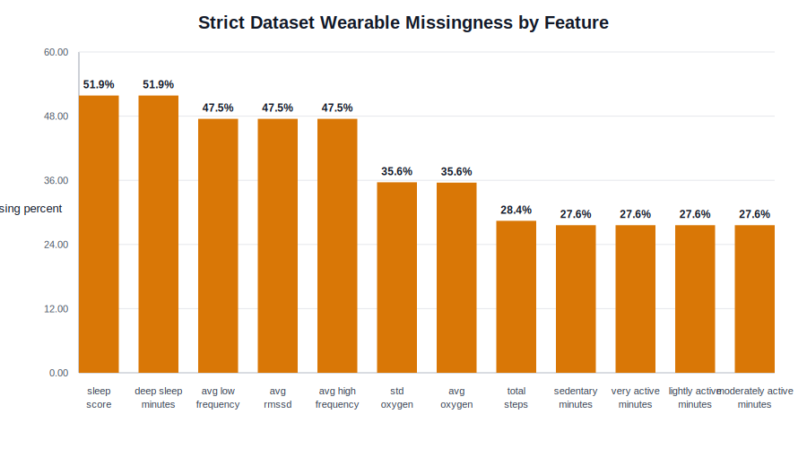
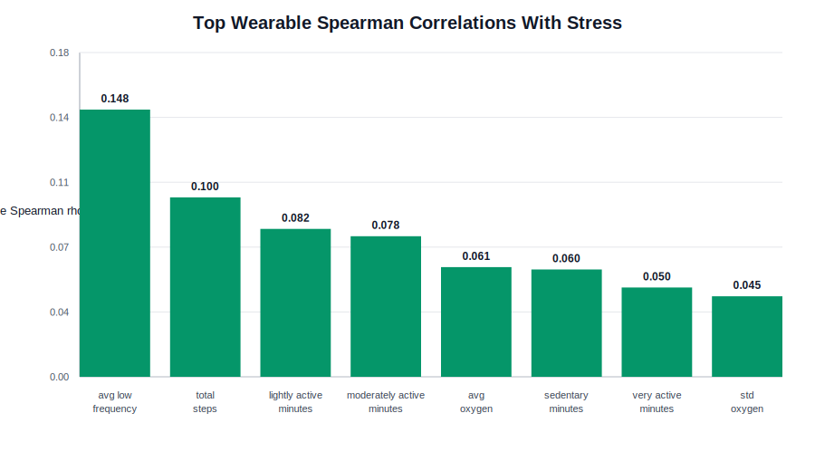

# EDA 与数据处理素材

本模块用于支持最终报告中的 Dataset、Preprocessing、Feature Engineering、Validation Strategy，以及部分 Discussion。

## 数据集来源与任务

| 项 | 内容 |
|---|---|
| 数据集 | SSAQS |
| URL | `https://doi.org/10.1038/s41597-026-07085-7` |
| 参与者 | 35 名本科生 |
| 采集周期 | 2025-02-14 至 2025-07-09 |
| 设备 | Fitbit Inspire 3 |
| 日级目标 | daily questionnaire 中的自报 stress score |
| 预测形式 | 三分类：Low / Medium / High |

## strict 数据规模

| 指标 | 值 |
|---|---:|
| student-day observations | 3118 |
| students | 35 |
| unique student-day pairs | 3118 |
| mean student-days per student | 89.09 |
| median student-days per student | 102.0 |
| minimum student-days per student | 7 |
| maximum student-days per student | 133 |

学生贡献天数存在明显差异：最少的学生只有 7 天，最多的学生有 133 天。这说明模型评估不能随机按行切分，否则同一学生的相邻日期很容易同时出现在训练和测试中。

## 重复 student-day 处理

strict cleaning 从原始合并表中处理重复记录：

| 项 | 值 |
|---|---:|
| raw rows before duplicate resolution | 3133 |
| cleaned rows | 3118 |
| duplicate student-day pairs resolved | 15 |
| duplicate student-days after cleaning | 0 |

处理规则：

- 同一 `student_id + date` 的多条数值记录取平均。
- 清洗后重新根据平均后的 `stress` 生成 `stress_label`。
- wearable 缺失值保持缺失，不在清洗阶段填补。
- 特征标准化不在清洗阶段执行。

## 标签构建

`stress` 是 0-100 的连续自报分数。strict pipeline 使用以下分箱：

| Label | Stress score range | Count | Percent |
|---|---:|---:|---:|
| Low | 0-17 | 1082 | 34.70% |
| Medium | 18-38 | 984 | 31.56% |
| High | 39-100 | 1052 | 33.74% |

标签阈值检查：

| Label | Count | Min | Max | Mean | Median | SD |
|---|---:|---:|---:|---:|---:|---:|
| Low | 1082 | 0 | 17 | 9.561 | 10 | 4.935 |
| Medium | 984 | 18 | 38 | 26.805 | 27 | 5.904 |
| High | 1052 | 39 | 100 | 63.559 | 59 | 18.905 |

类别分布接近均衡但仍非完全均衡，因此主指标使用 macro-F1。

图：

## Train/Test Split

strict pipeline 使用 subject-aware split，保证同一学生只出现在训练集或测试集之一。

| Split | Students | Rows | Low | Medium | High |
|---|---:|---:|---:|---:|---:|
| train | 26 | 2217 | 696 | 717 | 804 |
| test | 9 | 901 | 386 | 267 | 248 |

设置：

- `GroupShuffleSplit`
- `test_size = 0.25`
- `random_state = 49`
- group column = `student_id`

方法解释要点：

- 该设计评估模型对 unseen students 的泛化能力。
- 这比随机按行切分更严格，因为它不能利用同一学生的个体基线信息。
- 测试集只有 9 名学生，因此最终性能估计存在不稳定性，应在 limitation 中说明。

## 原始模态覆盖率

以有 self-reported stress 的 target days 为基准，不同原始 Fitbit 模态覆盖率如下：

| File | Students | Total target days | Covered target days | Mean student coverage | Overall target-day coverage |
|---|---:|---:|---:|---:|---:|
| daily_questions.csv | 35 | 3118 | 3118 | 100.00% | 100.00% |
| activity_level.csv | 35 | 3118 | 2257 | 69.20% | 72.39% |
| steps.csv | 35 | 3118 | 2232 | 68.49% | 71.58% |
| oxygen.csv | 35 | 3118 | 2009 | 61.16% | 64.43% |
| hrv.csv | 35 | 3118 | 1637 | 48.99% | 52.50% |
| sleep.csv | 35 | 3118 | 1508 | 44.79% | 48.36% |
| stress.csv | 35 | 3118 | 1466 | 43.68% | 47.02% |

可用于报告的解释：

- Fitbit 模态覆盖率差异明显，sleep 和 HRV 的覆盖率低于 activity/steps。
- 因为 wearable 数据存在大量缺失，不能简单删除缺失行，否则会丢失大量 student-day。
- 因此后续建模在 pipeline 内使用 `SimpleImputer(strategy="median")`。

## 建模特征缺失率

按特征组：

| Feature group | Features | Missing cells | Total cells | Missing percent | Complete rows | Complete percent |
|---|---:|---:|---:|---:|---:|---:|
| Sleep | 2 | 3234 | 6236 | 51.86% | 1501 | 48.14% |
| Activity | 5 | 4330 | 15590 | 27.77% | 2232 | 71.58% |
| HRV | 3 | 4443 | 9354 | 47.50% | 1637 | 52.50% |
| SpO2 | 2 | 2220 | 6236 | 35.60% | 2007 | 64.37% |

按单个特征：

| Feature | Missing rows | Missing percent |
|---|---:|---:|
| sleep_score | 1617 | 51.86% |
| deep_sleep_minutes | 1617 | 51.86% |
| avg_low_frequency | 1481 | 47.50% |
| avg_rmssd | 1481 | 47.50% |
| avg_high_frequency | 1481 | 47.50% |
| std_oxygen | 1111 | 35.63% |
| avg_oxygen | 1109 | 35.57% |
| total_steps | 886 | 28.42% |
| sedentary_minutes | 861 | 27.61% |
| lightly_active_minutes | 861 | 27.61% |
| moderately_active_minutes | 861 | 27.61% |
| very_active_minutes | 861 | 27.61% |

图：

## 特征组定义

| Feature group | Features |
|---|---|
| Sleep | `sleep_score`, `deep_sleep_minutes` |
| Activity | `total_steps`, `sedentary_minutes`, `lightly_active_minutes`, `moderately_active_minutes`, `very_active_minutes` |
| HRV | `avg_rmssd`, `avg_low_frequency`, `avg_high_frequency` |
| SpO2 | `avg_oxygen`, `std_oxygen` |

主实验排除以下列：

- `student_id`
- `date`
- `stress`
- `stress_label`
- `anxiety`
- `STRESS_SCORE`
- `CALCULATION_FAILED`

## 单变量相关性

Wearable 单变量与 stress 的 Spearman 相关性整体较弱：

| Feature | Spearman rho with stress |
|---|---:|
| avg_low_frequency | -0.148 |
| total_steps | 0.100 |
| lightly_active_minutes | 0.082 |
| moderately_active_minutes | 0.078 |
| avg_oxygen | 0.061 |
| sedentary_minutes | 0.060 |
| very_active_minutes | 0.050 |
| std_oxygen | 0.045 |
| avg_high_frequency | 0.026 |
| avg_rmssd | 0.019 |
| sleep_score | 0.003 |
| deep_sleep_minutes | -0.018 |

图：

解释要点：

- 没有单个 wearable feature 与 stress 呈现强相关。
- 这支持使用多变量模型，而不是依赖单一阈值或单一特征。
- 这也解释了为什么最终预测性能只有 modest 水平。

## 按标签的标准化特征均值

图：

使用方式：

- 可作为补充图说明不同压力等级之间的 wearable feature 差异较弱。
- 不建议在报告中把这些差异解释为因果关系。
- 如果篇幅有限，优先使用 label distribution、missingness 或 RQ 结果图。

## 学生贡献天数差异

图：

可用于 limitation：

- 学生贡献天数高度不均。
- 一些学生只有很短的观测窗口，这会增加 subject-level split 的不稳定性。
- 测试集只有 9 名学生，结果应解释为 conservative held-out estimate。

## 时间趋势 EDA

| Day type | N | Mean stress | SD stress |
|---|---:|---:|---:|
| Weekday | 2235 | 33.91 | 25.35 |
| Weekend | 883 | 31.48 | 26.34 |

周趋势：

| 指标 | 结果 |
|---|---|
| Lowest weekly mean stress | Week 21, M = 13.62, SD = 12.92 |
| Highest weekly mean stress | Week 6, M = 40.59, SD = 27.21 |

时间趋势主要用于支持 RQ3：压力存在随学期变化的模式，因此测试 semester week、lag 和 rolling 特征是合理的。

## 可用于 Method 的要点

- 数据被聚合到 student-day 粒度，每一行对应一名学生在一天的问卷压力标签和同日 wearable summaries。
- 标签由 0-100 stress score 分箱得到：Low 0-17、Medium 18-38、High 39-100。
- 对重复 student-day 先合并再重新分箱，最终没有重复 student-day。
- 使用 subject-aware train/test split，避免同一学生同时出现在训练和测试中。
- 缺失值和标准化不在全数据上预处理，而是在模型 pipeline 内部完成。
- 主要指标是 macro-F1，因为该任务关注三个类别的均衡表现。

## 可用于 Discussion 的要点

- Wearable 单变量相关性弱，说明压力预测不是简单线性阈值问题。
- 缺失率较高，特别是 sleep 和 HRV，这可能限制模型性能。
- 小样本和测试学生数少会导致结果不稳定。
- 自报压力标签主观且噪声大，可能削弱 wearable 特征与标签之间的映射。
