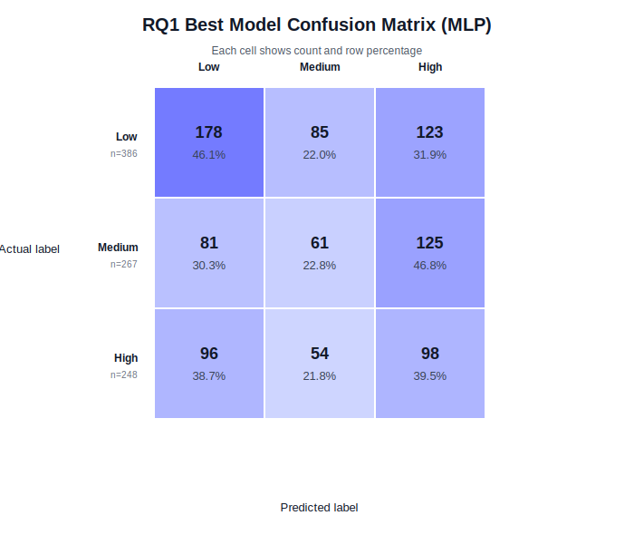

# RQ1 素材：Wearable-only 压力等级预测

## 研究问题

RQ1：仅使用 Fitbit-derived wearable features，能否预测学生当天的自报压力等级 Low / Medium / High？

## 任务定义

| 项 | 内容 |
|---|---|
| 输入 | 12 个 wearable features |
| 输出 | `stress_label`: Low / Medium / High |
| 数据粒度 | student-day |
| Train/test split | subject-aware split |
| Train students / rows | 26 students / 2217 rows |
| Test students / rows | 9 students / 901 rows |
| 主指标 | test macro-F1 |
| 调参方式 | train set 内部 GroupKFold + GridSearchCV |

## RQ1 特征

| Feature group | Features |
|---|---|
| Sleep | `sleep_score`, `deep_sleep_minutes` |
| Activity | `total_steps`, `sedentary_minutes`, `lightly_active_minutes`, `moderately_active_minutes`, `very_active_minutes` |
| HRV + SpO2 | `avg_rmssd`, `avg_low_frequency`, `avg_high_frequency`, `avg_oxygen`, `std_oxygen` |

不使用 `stress`、`anxiety`、`STRESS_SCORE`、`CALCULATION_FAILED`、`student_id`、`date` 作为模型输入。

## 模型与调参

| Model | Model family | Tuned hyperparameters |
|---|---|---|
| Majority baseline | Dummy classifier | none |
| Logistic Regression | Linear | `C=[0.1, 1.0, 10.0]` |
| SVM | Kernel / margin-based | `C=[0.1, 1.0, 10.0]`, `kernel=[linear, rbf]` |
| kNN | Instance-based | `n_neighbors=[3, 5, 9]` |
| Random Forest | Bagging tree ensemble | `n_estimators=[100, 300]`, `max_depth=[5, 10, None]` |
| Gradient Boosting | Boosting tree ensemble | `n_estimators=[100, 200]`, `learning_rate=[0.05, 0.1]`, `max_depth=[2, 3]` |
| MLP | Neural network | `hidden_layer_sizes=[(32,), (64,), (32,16)]`, `alpha=[0.0001, 0.001]` |

Pipeline 设置：

- 所有非-baseline 模型都使用 `SimpleImputer(strategy="median")`。
- Logistic Regression、SVM、kNN、MLP 额外使用 `StandardScaler`。
- GridSearchCV 使用 `scoring="f1_macro"`。
- CV groups 使用 `student_id`。

## RQ1 完整结果

| Model | Accuracy | Macro-F1 | Low F1 | Medium F1 | High F1 | CV Macro-F1 | Best params |
|---|---:|---:|---:|---:|---:|---:|---|
| MLP | 0.374 | 0.357 | 0.480 | 0.261 | 0.330 | 0.362 | `alpha=0.001`, `hidden_layer_sizes=(64,)` |
| SVM | 0.375 | 0.356 | 0.490 | 0.251 | 0.327 | 0.353 | `C=10.0`, `kernel=rbf` |
| Gradient Boosting | 0.374 | 0.355 | 0.479 | 0.238 | 0.347 | 0.353 | `learning_rate=0.1`, `max_depth=3`, `n_estimators=200` |
| Random Forest | 0.367 | 0.349 | 0.468 | 0.231 | 0.348 | 0.368 | `max_depth=10`, `n_estimators=100` |
| Logistic Regression | 0.290 | 0.283 | 0.327 | 0.301 | 0.220 | 0.289 | `C=0.1` |
| kNN | 0.285 | 0.277 | 0.172 | 0.301 | 0.358 | 0.296 | `n_neighbors=3` |
| Majority baseline | 0.275 | 0.144 | 0.000 | 0.000 | 0.432 | N/A | none |

## 主要发现

| 项 | 结果 |
|---|---|
| Best model | MLP |
| Best test macro-F1 | 0.357 |
| Majority baseline test macro-F1 | 0.144 |
| Best traditional ML model | SVM, macro-F1 = 0.356 |
| Hardest class for best model | Medium, F1 = 0.261 |

RQ1 的最佳模型 MLP 只比 SVM 高 0.001 macro-F1，因此不应把结论写成 neural network 明显优于传统模型。更准确的说法是：多个非线性模型表现接近，MLP 在 test macro-F1 上略高。

## Best model confusion matrix

MLP confusion matrix:

| Actual | Predicted Low | Predicted Medium | Predicted High |
|---|---:|---:|---:|
| Low (n=386) | 178 (46.1%) | 85 (22.0%) | 123 (31.9%) |
| Medium (n=267) | 81 (30.3%) | 61 (22.8%) | 125 (46.8%) |
| High (n=248) | 96 (38.7%) | 54 (21.8%) | 98 (39.5%) |

图：

## Error analysis

关键错误模式：

- Medium 类最难预测，F1 = 0.261。
- Actual Medium 中只有 61 个被预测为 Medium，占 Medium 行的 22.8%。
- Actual Medium 被预测为 High 的数量是 125，占 Medium 行的 46.8%，是该行最大错误项。
- Actual Low 也经常被预测为 High：123 个 Low 被预测为 High，占 Low 行的 31.9%。
- 模型对 Low 的 F1 最高，为 0.480。

可能原因：

- Medium 类在语义上位于 Low 和 High 之间，边界模糊。
- 自报 stress 标签存在主观噪声，Medium 区间更容易受个体标准差异影响。
- Wearable 特征与主观压力之间映射较弱，单日生理/行为信号未必能区分中等压力。
- Subject-aware split 要求模型泛化到 unseen students，无法依赖个体固定基线。

## 可用于 Results 的要点

- RQ1 最佳模型为 MLP，test macro-F1 = 0.357。
- Majority baseline macro-F1 = 0.144，说明 wearable features 提供了高于简单基线的预测信号。
- SVM、Gradient Boosting、Random Forest 和 MLP 的结果接近，说明非线性模型总体优于 Logistic Regression 和 kNN。
- Accuracy 最高的模型是 SVM，accuracy = 0.375，但主指标 macro-F1 最高的是 MLP。

## 可用于 Discussion 的要点

- 结果支持 wearable-only stress prediction 有一定可行性，但性能是 modest，而非 strong。
- 与文献中较高的 Fitbit/stress classification 分数相比，本项目采用 unseen-student split，因此评估更保守。
- Medium 类错误说明三分类 stress binning 的中间等级最不稳定。
- 低性能不一定说明 pipeline 失败，而可能反映 wearable 信号与自报心理状态之间本来就存在噪声。

## 可用于 Conclusion 的要点

RQ1 的回答：wearable features 可以提供高于 majority baseline 的预测信息，但仅凭同日 wearable summaries 对 unseen students 的 stress level 预测能力有限。
