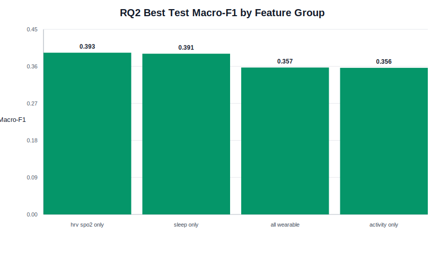
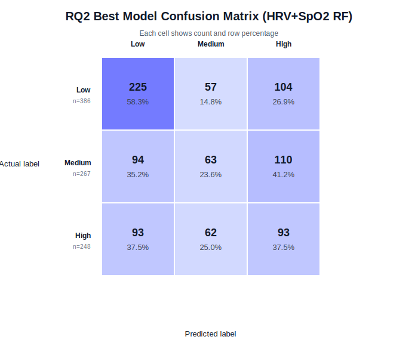

# RQ2 素材：Feature-group contribution

## 研究问题

RQ2：不同 wearable feature groups 是否对压力预测有不同贡献？

Feature groups:

- Sleep only
- Activity only
- HRV + SpO2 only
- All wearable

## 实验设计

| 项 | 内容 |
|---|---|
| 数据 | strict model data |
| Split | 与 RQ1 相同的 subject-aware train/test split |
| Train/test | 26 train students / 9 test students |
| 模型集合 | 与 RQ1 相同 |
| 调参 | 每个 feature group 内部对所有模型进行 GroupKFold + GridSearchCV |
| 主指标 | test macro-F1 |
| 缺失值处理 | model pipeline 内部 median imputation |

## Feature groups

| Feature group | N features | Features |
|---|---:|---|
| Sleep only | 2 | `sleep_score`, `deep_sleep_minutes` |
| Activity only | 5 | `total_steps`, `sedentary_minutes`, `lightly_active_minutes`, `moderately_active_minutes`, `very_active_minutes` |
| HRV + SpO2 only | 5 | `avg_rmssd`, `avg_low_frequency`, `avg_high_frequency`, `avg_oxygen`, `std_oxygen` |
| All wearable | 12 | Sleep + Activity + HRV + SpO2 |

## 每个 feature group 的最佳结果

| Feature group | N features | Best model | Accuracy | Macro-F1 | Low F1 | Medium F1 | High F1 | CV Macro-F1 | Best params |
|---|---:|---|---:|---:|---:|---:|---:|---:|---|
| HRV + SpO2 only | 5 | Random Forest | 0.423 | 0.393 | 0.564 | 0.281 | 0.335 | 0.364 | `max_depth=10`, `n_estimators=100` |
| Sleep only | 2 | Random Forest | 0.438 | 0.391 | 0.578 | 0.228 | 0.367 | 0.352 | `max_depth=5`, `n_estimators=100` |
| All wearable | 12 | MLP | 0.374 | 0.357 | 0.480 | 0.261 | 0.330 | 0.362 | `alpha=0.001`, `hidden_layer_sizes=(64,)` |
| Activity only | 5 | Gradient Boosting | 0.377 | 0.356 | 0.485 | 0.237 | 0.347 | 0.374 | `learning_rate=0.1`, `max_depth=3`, `n_estimators=200` |

图：

## 主要发现

| 项 | 结果 |
|---|---|
| Overall best feature group | HRV + SpO2 only |
| Overall best model | Random Forest |
| Overall best test macro-F1 | 0.393 |
| Closest feature group | Sleep only, macro-F1 = 0.391 |
| All wearable macro-F1 | 0.357 |
| Activity only macro-F1 | 0.356 |

重要对比：

- HRV + SpO2 only 比 all wearable 高 0.036 macro-F1。
- Sleep only 与 HRV + SpO2 only 非常接近，只低 0.002 macro-F1。
- All wearable 没有超过较小特征组。
- Activity only 的最佳 macro-F1 与 all wearable 接近，但略低。

## RQ2 best model confusion matrix

Best condition: HRV + SpO2 only + Random Forest.

| Actual | Predicted Low | Predicted Medium | Predicted High |
|---|---:|---:|---:|
| Low (n=386) | 225 (58.3%) | 57 (14.8%) | 104 (26.9%) |
| Medium (n=267) | 94 (35.2%) | 63 (23.6%) | 110 (41.2%) |
| High (n=248) | 93 (37.5%) | 62 (25.0%) | 93 (37.5%) |

图：

Error pattern:

- Low 类预测最好，F1 = 0.564。
- Medium 类仍然最难，F1 = 0.281。
- Actual Medium 最常被预测为 High：110 个，占 Medium 行的 41.2%。
- Actual High 中 93 个被预测为 Low，93 个被正确预测为 High，二者各占 High 行的 37.5%，说明 High 的边界也不稳定。

## 如何解释 HRV + SpO2 only 最好

可用解释：

- HRV 与 autonomic nervous system regulation 相关，理论上与压力反应更直接。
- SpO2 可能反映呼吸、生理恢复或睡眠质量相关状态，与压力有间接联系。
- 相比 activity minutes，HRV/SpO2 更接近生理压力反应而非外部行为模式。
- Random Forest 能处理非线性关系和特征交互，因此在这个小特征组上表现较好。

建议表述：

- HRV/SpO2 feature group 在本 split 和 strict setting 下提供了最强 predictive signal。
- 这里的结果支持 predictive association，不直接证明 HRV/SpO2 与压力之间的因果关系。

## 如何解释 all wearable 不如小特征组

这是 RQ2 最有价值的发现。

可用解释：

- All wearable 有 12 个特征，但样本只有 35 名学生，subject-level training data 有限。
- 额外模态可能加入噪声和缺失模式，而不是提供稳定互补信息。
- Sleep 和 HRV 特征缺失率较高，全特征模型需要在更多维度上依赖 imputation。
- 在 unseen-student setting 下，更多特征可能增加模型方差。
- All wearable 的最佳模型是 MLP，而小样本下 MLP 未必能充分利用多模态信息。

## 如何解释 Sleep only 接近最佳

可用解释：

- Sleep 与学生压力、恢复状态和学期负荷有理论关联。
- Sleep only 只有 2 个特征，模型复杂度较低，可能更稳健。
- Sleep only accuracy 最高，为 0.438，但 macro-F1 略低于 HRV + SpO2，说明它对类别均衡表现不如 HRV + SpO2。

## 如何解释 Activity only 较弱

可用解释：

- 步数和活动分钟数反映行为模式，但每日行为与主观压力之间可能不是单调关系。
- 学生可能在压力高时活动减少，也可能因通勤、课程或考试安排而活动增加。
- Activity summaries 的语义受日程影响强，未必能直接区分心理压力等级。

## 可用于 Results 的要点

- RQ2 最佳组合为 HRV + SpO2 only + Random Forest，test macro-F1 = 0.393。
- Sleep only 几乎达到同等表现，macro-F1 = 0.391。
- All wearable macro-F1 = 0.357，没有超过较小特征组。
- Activity only 是最弱 feature group，macro-F1 = 0.356。

## 可用于 Discussion 的要点

- RQ2 支持 wearable 模态之间贡献不同。
- 生理自主神经相关特征和睡眠特征比活动特征更有预测价值。
- 更多特征不一定更好，特别是在小样本、缺失率较高、subject-aware split 的设置下。
- 这个结果应作为 feature ablation 的核心发现，而不只是附属结果。

## 可用于 Conclusion 的要点

RQ2 的回答：不同 wearable feature groups 的预测贡献不同；HRV + SpO2 和 sleep features 提供最强信号，而 all wearable feature set 没有带来额外收益。
