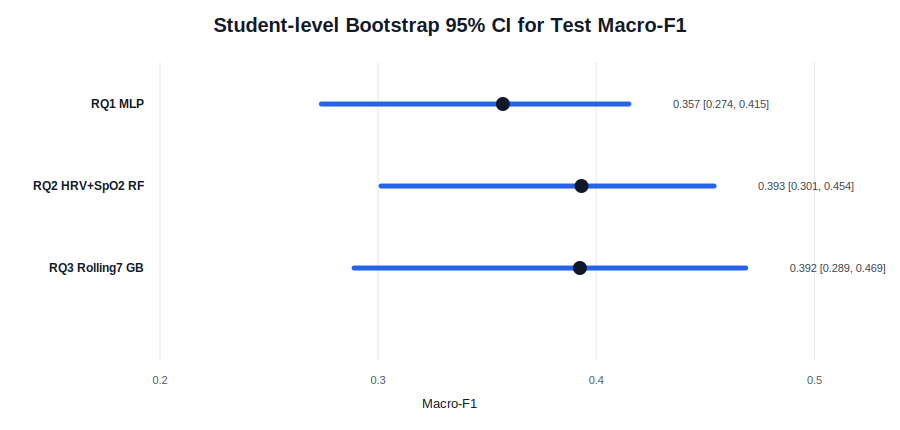
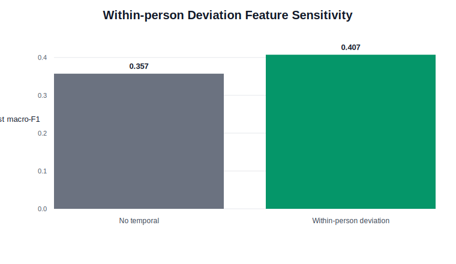

# Sensitivity / Robustness 分析素材

本模块用于增强 Method 和 Critical Analysis，重点回答两个问题：

1. 测试集只有 9 名学生时，最终 test macro-F1 有多不稳定？
2. 加入更有个体化含义的 leakage-safe 特征后，模型表现是否改善？

对应代码：

- `scripts/sensitivity/run_strict_sensitivity.py`

对应 strict 输出：

- `modeling_outputs/strict_pipeline/07_sensitivity/`

## 1. Student-level bootstrap confidence intervals

目的：

- 原始 test set 只有 9 名学生。
- 普通 bootstrap 如果按行重采样，会破坏同一学生多天观测的相关结构。
- 因此这里按 student 作为重采样单位：每次从 9 个 test students 中有放回抽样，再合并这些学生的所有 student-days，计算 macro-F1。

设置：

| 项 | 值 |
|---|---:|
| Bootstrap unit | test student |
| Test students | 9 |
| Bootstrap draws | 2000 |
| Metric | macro-F1 |
| Random seed | 49 |

结果：

| Analysis | Point macro-F1 | Bootstrap mean | 95% CI lower | 95% CI upper |
|---|---:|---:|---:|---:|
| RQ1 all wearable + MLP | 0.357 | 0.345 | 0.274 | 0.415 |
| RQ2 HRV + SpO2 + Random Forest | 0.393 | 0.381 | 0.301 | 0.454 |
| RQ3 rolling7 wearable + Gradient Boosting | 0.392 | 0.378 | 0.289 | 0.469 |

图：



可用于 Discussion：

- 三个主要结果的 confidence interval 都较宽，说明 test macro-F1 对测试学生构成敏感。
- RQ2 和 RQ3 的 point estimate 高于 RQ1，但 CI 明显重叠，因此不能夸大模型之间的差异。
- 这不是否定结果，而是说明在 N=35 / test students=9 的设置下，结论应写成 cautious evidence。
- 这项分析是对“小样本测试集不稳定”这一 limitation 的量化回应。

## 2. Leave-one-train-student-out sensitivity

目的：

- 在训练学生内部做 leave-one-student-out 风格敏感性分析。
- 使用每个 RQ 的 fixed best estimator，不重新调参。
- 每次留出一个 train student 作为 validation student，评估 macro-F1。
- 这不是最终测试分数的替代，而是用来展示不同学生之间泛化难度的差异。

结果：

| Analysis | Train students | Mean macro-F1 | SD | Min | Max |
|---|---:|---:|---:|---:|---:|
| RQ1 all wearable + MLP | 26 | 0.282 | 0.104 | 0.000 | 0.443 |
| RQ2 HRV + SpO2 + RF | 26 | 0.275 | 0.105 | 0.000 | 0.423 |
| RQ3 rolling7 + GB | 26 | 0.261 | 0.111 | 0.000 | 0.417 |

解释：

- Fold-level macro-F1 变化很大，说明 student-level generalisation 是本任务的核心难点。
- 部分 held-out train students 的 macro-F1 接近 0，可能与该学生标签分布极端、观测天数少、或 wearable 缺失模式有关。
- 这支持报告中关于 individual heterogeneity 和 small-sample instability 的 limitation。

可用于 Discussion：

- Subject-aware evaluation 比 random row split 更严格。
- 学生之间差异大，因此模型在 unseen students 上的稳定性有限。
- 未来工作可考虑 personalised modelling 或 larger multi-site cohorts。

## 3. Leakage-safe within-person deviation features

目的：

- 增加一种更有个体化意义的 feature engineering。
- 解决不同学生 wearable baseline 不同的问题。
- 测试“当前值相对该学生过去基线的偏离”是否比原始日级 wearable 值更有预测价值。

构造方式：

对每个 wearable feature，构造：

```text
deviation_today = current_value_today - expanding_mean_of_previous_days
```

关键防泄漏设置：

- expanding mean 使用同一学生过去日期。
- 使用 `shift(1)`，因此不包含当天信息。
- 不使用未来日期。
- 不使用 stress/anxiety/STRESS_SCORE。

实验条件：

| Condition | Features |
|---|---|
| no_temporal | 12 original wearable features |
| deviation_only | 12 original wearable features + 12 within-person deviation features |

每个 condition 仍使用完整模型集合和 GroupKFold + GridSearchCV 调参。

最佳结果：

| Condition | N features | Best model | Accuracy | Macro-F1 | Low F1 | Medium F1 | High F1 |
|---|---:|---|---:|---:|---:|---:|---:|
| no_temporal | 12 | MLP | 0.374 | 0.357 | 0.480 | 0.261 | 0.330 |
| deviation_only | 24 | Gradient Boosting | 0.416 | 0.407 | 0.488 | 0.344 | 0.390 |

图：



主要发现：

- within-person deviation condition 的最佳 macro-F1 = 0.407。
- 相比 no_temporal baseline 0.357，提升 +0.050。
- Medium F1 从 0.261 提升到 0.344。
- High F1 从 0.330 提升到 0.390。
- 最佳模型从 MLP 变为 Gradient Boosting。

可用于 Method：

- 该实验属于 personalised feature engineering，但仍然保持 unseen-student evaluation。
- deviation features 只使用每名学生过去的 wearable history，因此避免 temporal leakage。

可用于 Discussion：

- 结果支持“相对个人历史基线的变化”比绝对 wearable value 更有信息。
- 这回应了 individual baseline differences 的 limitation。
- 该结果也说明未来工作可以进一步探索 personalised or hybrid population-personal models。
- 由于这是补充 sensitivity analysis，应写成 promising auxiliary finding，而不是替代 RQ1/RQ2/RQ3 主结果。

## 可放入最终报告的写法要点

- 在 Method 中简要说明：除了主实验，还进行了 student-level bootstrap、leave-one-student-out sensitivity 和 leakage-safe within-person deviation feature experiment。
- 在 Results 或 Discussion 中报告 bootstrap CI，说明 test set uncertainty。
- 在 Discussion 中报告 deviation feature 的 +0.050 macro-F1 提升，作为尝试克服个体差异限制的证据。
- 在 Limitations 中说明：尽管做了 sensitivity analysis，样本仍只有 35 名学生，结论仍需更大 cohort 验证。

## 文件

| 文件 | 内容 |
|---|---|
| `student_bootstrap_ci.csv` | 三个主结果的 student-level bootstrap CI |
| `train_group_cv_best_model_sensitivity.csv` | leave-one-train-student-out 汇总 |
| `within_person_deviation_results.csv` | deviation feature 完整模型结果 |
| `within_person_deviation_tuning.csv` | deviation feature 调参结果 |
| `figures/bootstrap_macro_f1_ci.svg` | bootstrap CI 图 |
| `figures/within_person_deviation_macro_f1.svg` | deviation 特征对比图 |
