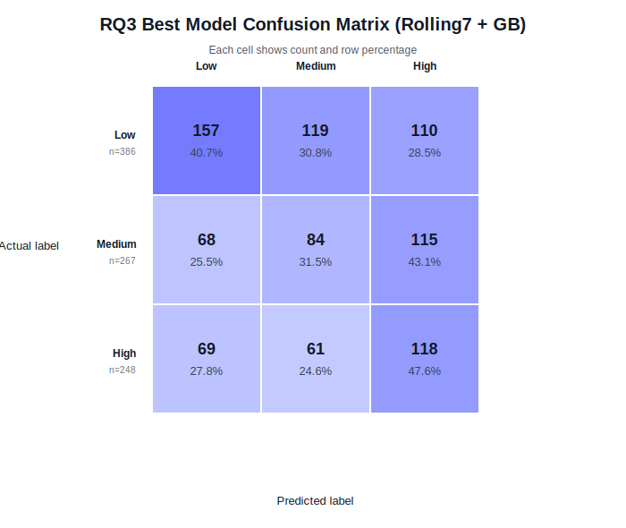
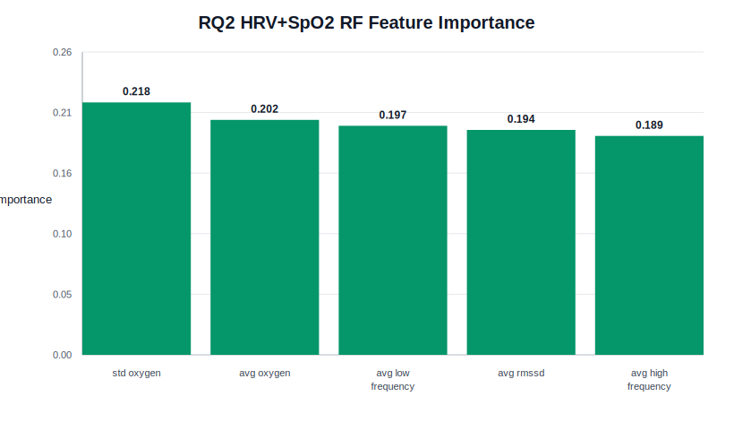

# 补充素材：超参数表、RQ3混淆矩阵、RQ2特征重要性

本模块补充三个最终报告可能需要的材料：

1. 正式的模型超参数汇总表。
2. RQ3 最佳模型的 confusion matrix 图。
3. RQ2 最佳 Random Forest 模型的 feature importance 图。

## 1. 模型超参数汇总表

这张表可直接支持 Method / Models and Hyperparameter Tuning 部分。RQ1、RQ2、RQ3 使用同一套模型候选网格；RQ2 和 RQ3 在各自 feature group 或 temporal condition 内重新进行 GroupKFold + GridSearchCV 调参。

CSV 文件：

- `hyperparameter_summary_table.csv`

| Model | Algorithm family | Pipeline preprocessing | Tuning method | Candidate range | N candidates | RQ1 selected value | RQ1 CV macro-F1 |
|---|---|---|---|---|---:|---|---:|
| Majority baseline | Dummy classifier | SimpleImputer(median) | No tuning | N/A | 1 | N/A | N/A |
| Logistic Regression | Linear model | SimpleImputer(median) + StandardScaler | GroupKFold + GridSearchCV, scoring=f1_macro | `C = {0.1, 1.0, 10.0}` | 3 | `C = 0.1` | 0.289 |
| SVM | Kernel / margin-based classifier | SimpleImputer(median) + StandardScaler | GroupKFold + GridSearchCV, scoring=f1_macro | `C = {0.1, 1.0, 10.0}; kernel = {linear, rbf}` | 6 | `C = 10.0; kernel = rbf` | 0.353 |
| kNN | Instance-based classifier | SimpleImputer(median) + StandardScaler | GroupKFold + GridSearchCV, scoring=f1_macro | `n_neighbors = {3, 5, 9}` | 3 | `n_neighbors = 3` | 0.296 |
| Random Forest | Bagging tree ensemble | SimpleImputer(median) | GroupKFold + GridSearchCV, scoring=f1_macro | `n_estimators = {100, 300}; max_depth = {5, 10, None}` | 6 | `n_estimators = 100; max_depth = 10` | 0.368 |
| Gradient Boosting | Boosting tree ensemble | SimpleImputer(median) | GroupKFold + GridSearchCV, scoring=f1_macro | `n_estimators = {100, 200}; learning_rate = {0.05, 0.1}; max_depth = {2, 3}` | 8 | `n_estimators = 200; learning_rate = 0.1; max_depth = 3` | 0.353 |
| MLP | Neural network | SimpleImputer(median) + StandardScaler | GroupKFold + GridSearchCV, scoring=f1_macro | `hidden_layer_sizes = {(32,), (64,), (32,16)}; alpha = {0.0001, 0.001}` | 6 | `hidden_layer_sizes = (64,); alpha = 0.001` | 0.362 |

可用于报告的说明：

- Dummy baseline 不需要调参。
- 其余模型至少调了一个超参数。
- 调参只在训练集内部完成，CV group 为 `student_id`。
- Test set 只用于最终评估。
- 树模型不需要 StandardScaler；LR/SVM/kNN/MLP 使用 StandardScaler。

## 2. RQ3 最佳模型 Confusion Matrix

RQ3 最佳模型：

| 条件 | 模型 | Test macro-F1 |
|---|---|---:|
| rolling7_wearable | Gradient Boosting | 0.392 |

Confusion matrix:

| Actual | Predicted Low | Predicted Medium | Predicted High |
|---|---:|---:|---:|
| Low (n=386) | 157 (40.7%) | 119 (30.8%) | 110 (28.5%) |
| Medium (n=267) | 68 (25.5%) | 84 (31.5%) | 115 (43.1%) |
| High (n=248) | 69 (27.8%) | 61 (24.6%) | 118 (47.6%) |

图：

可用于 error analysis：

- Medium 仍然是最难分类的类别，说明 temporal features 没有完全解决中间类别边界模糊的问题。
- Actual Medium 最常被预测为 High，数量为 115，占 Medium 行的 43.1%。
- Actual High 中 118 个被正确预测为 High，占 High 行的 47.6%；69 个被误分为 Low，占 27.8%。
- Actual Low 中 157 个被正确预测为 Low，占 Low 行的 40.7%；119 个被误分为 Medium，占 30.8%。
- 与 RQ1 best MLP 相比，RQ3 best model 的 High F1 有提升，这说明 rolling features 可能更有助于识别高压力状态。
- RQ3 的改进幅度应描述为 modest improvement，而不是 large improvement。

## 3. RQ2 HRV + SpO2 Random Forest Feature Importance

RQ2 最佳组合：

| Feature group | Model | Test macro-F1 |
|---|---|---:|
| HRV + SpO2 only | Random Forest | 0.393 |

Feature importance CSV：

- `rq2_hrv_spo2_rf_feature_importance.csv`

| Feature | Importance |
|---|---:|
| std_oxygen | 0.218 |
| avg_oxygen | 0.202 |
| avg_low_frequency | 0.197 |
| avg_rmssd | 0.194 |
| avg_high_frequency | 0.189 |

图：

可用于 Discussion：

- 在 RQ2 最佳 Random Forest 中，SpO2 相关特征 `std_oxygen` 和 `avg_oxygen` 排名前两位。
- HRV 相关特征的 importance 彼此接近，说明模型没有只依赖单一 HRV 指标。
- 5 个特征的重要性差异不极端，说明 HRV + SpO2 group 内部多个特征共同贡献预测。
- 该 importance 解释的是该 Random Forest 模型内部的预测使用方式，适合支持 feature-group interpretation。

## 最终报告使用建议

优先级：

1. 超参数表属于 Method 的硬性支持材料，建议放入正文或压缩成较小表格。
2. RQ3 confusion matrix 图适合支持 temporal feature error analysis；如果页数紧张，可只保留数字表。
3. RQ2 feature importance 图可放在 Discussion 或作为 RQ2 结果补充；如果正文图数受限，可只引用 importance 数字。
