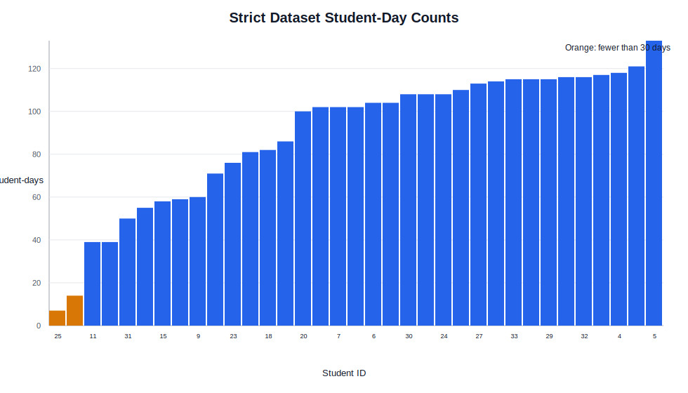
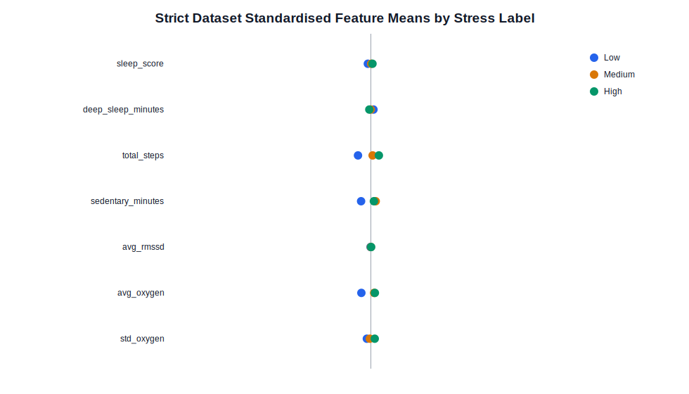

# Strict Pipeline EDA Summary

This EDA is generated only from `modeling_outputs/strict_pipeline/03_model_data/strict_model_data.csv` and is aligned with the final strict modelling pipeline.

## Dataset Scale

- Student-day observations: 3118
- Students: 35
- Unique student-day pairs: 3118
- Date range: 2025-02-14 to 2025-07-09
- Mean student-days per student: 89.09
- Median student-days per student: 102.0
- Min/max student-days per student: 7 / 133

## Label Distribution

| stress_label | count | percent |
| --- | --- | --- |
| Low | 1082 | 34.700 |
| Medium | 984 | 31.560 |
| High | 1052 | 33.740 |

The strict target bins are Low = 0-17, Medium = 18-38, and High = 39-100.

## Train/Test Split

| split | students | rows | low | medium | high |
| --- | --- | --- | --- | --- | --- |
| test | 9 | 901 | 386 | 267 | 248 |
| train | 26 | 2217 | 696 | 717 | 804 |

## Missingness

| feature_group | n_features | missing_cells | total_cells | missing_percent | complete_rows | complete_percent |
| --- | --- | --- | --- | --- | --- | --- |
| Sleep | 2 | 3234 | 6236 | 51.860 | 1501 | 48.140 |
| Activity | 5 | 4330 | 15590 | 27.770 | 2232 | 71.580 |
| HRV | 3 | 4443 | 9354 | 47.500 | 1637 | 52.500 |
| SpO2 | 2 | 2220 | 6236 | 35.600 | 2007 | 64.370 |

Feature-level missingness:

| feature | missing_rows | missing_percent |
| --- | --- | --- |
| sleep_score | 1617 | 51.860 |
| deep_sleep_minutes | 1617 | 51.860 |
| avg_low_frequency | 1481 | 47.500 |
| avg_rmssd | 1481 | 47.500 |
| avg_high_frequency | 1481 | 47.500 |
| std_oxygen | 1111 | 35.630 |
| avg_oxygen | 1109 | 35.570 |
| total_steps | 886 | 28.420 |
| sedentary_minutes | 861 | 27.610 |
| very_active_minutes | 861 | 27.610 |
| lightly_active_minutes | 861 | 27.610 |
| moderately_active_minutes | 861 | 27.610 |

## Stress Label Threshold Check

| stress_label | count | min | max | mean | median | std |
| --- | --- | --- | --- | --- | --- | --- |
| Low | 1082 | 0.000 | 17.000 | 9.561 | 10.000 | 4.935 |
| Medium | 984 | 18.000 | 38.000 | 26.805 | 27.000 | 5.904 |
| High | 1052 | 39.000 | 100.000 | 63.559 | 59.000 | 18.905 |

## Strongest Wearable Correlations With Stress

| feature | spearman_rho_with_stress |
| --- | --- |
| avg_low_frequency | -0.148 |
| total_steps | 0.100 |
| lightly_active_minutes | 0.082 |
| moderately_active_minutes | 0.078 |
| avg_oxygen | 0.061 |

These correlations are weak in absolute size. This supports using multivariate models and reporting modest performance expectations.

## Weekly Stress Trend

- Lowest mean stress: week 21, M = 13.62, SD = 12.92.
- Highest mean stress: week 6, M = 40.59, SD = 27.21.

## Generated Tables

- `modeling_outputs\strict_pipeline\eda\tables\strict_feature_descriptive_statistics.csv`
- `modeling_outputs\strict_pipeline\eda\tables\strict_feature_summary_by_stress_label.csv`
- `modeling_outputs\strict_pipeline\eda\tables\strict_label_distribution.csv`
- `modeling_outputs\strict_pipeline\eda\tables\strict_missingness_by_feature.csv`
- `modeling_outputs\strict_pipeline\eda\tables\strict_missingness_by_feature_group.csv`
- `modeling_outputs\strict_pipeline\eda\tables\strict_raw_modality_coverage_summary.csv`
- `modeling_outputs\strict_pipeline\eda\tables\strict_spearman_correlation_with_stress.csv`
- `modeling_outputs\strict_pipeline\eda\tables\strict_split_summary.csv`
- `modeling_outputs\strict_pipeline\eda\tables\strict_standardised_feature_means_by_label.csv`
- `modeling_outputs\strict_pipeline\eda\tables\strict_stress_label_threshold_check.csv`
- `modeling_outputs\strict_pipeline\eda\tables\strict_student_day_counts.csv`
- `modeling_outputs\strict_pipeline\eda\tables\strict_weekday_weekend_stress.csv`
- `modeling_outputs\strict_pipeline\eda\tables\strict_weekly_stress_summary.csv`

## Generated Figures

- `modeling_outputs\strict_pipeline\eda\figures\strict_feature_means_by_stress_label.svg`
- `modeling_outputs\strict_pipeline\eda\figures\strict_feature_missingness.svg`
- `modeling_outputs\strict_pipeline\eda\figures\strict_label_distribution.svg`
- `modeling_outputs\strict_pipeline\eda\figures\strict_student_day_counts.svg`
- `modeling_outputs\strict_pipeline\eda\figures\strict_top_spearman_correlations.svg`
- `modeling_outputs\strict_pipeline\eda\figures\strict_weekly_stress_trend.svg`

## Figure Previews

